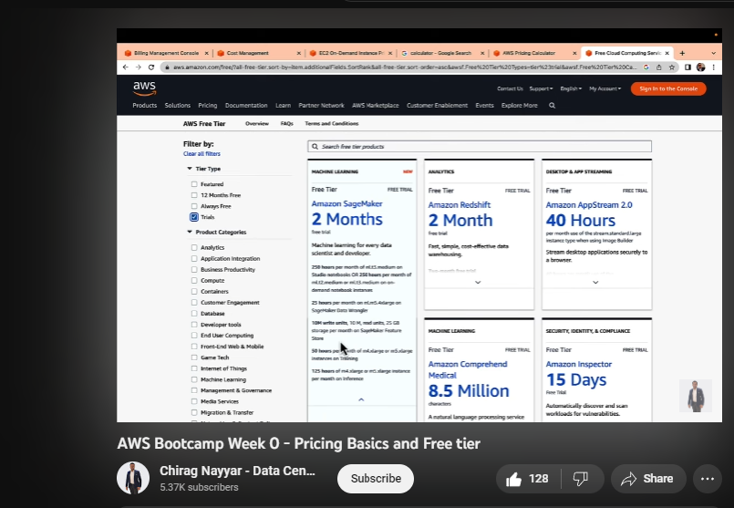
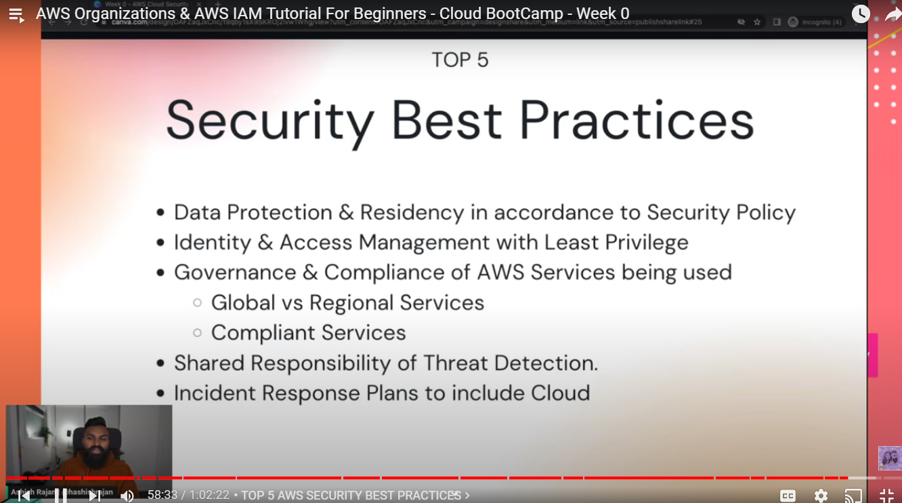
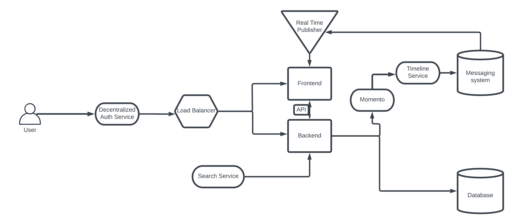
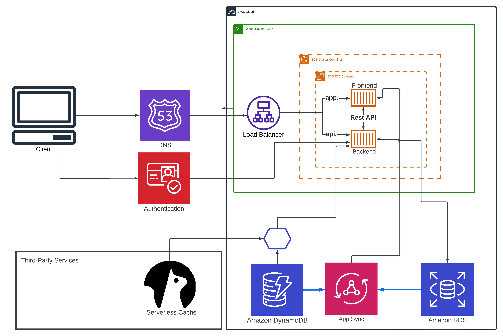
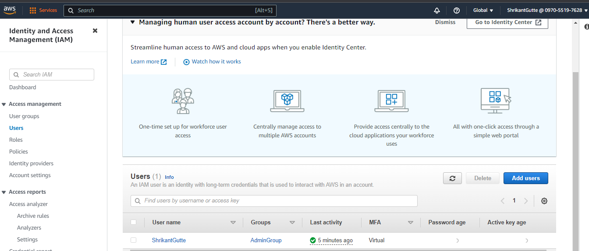
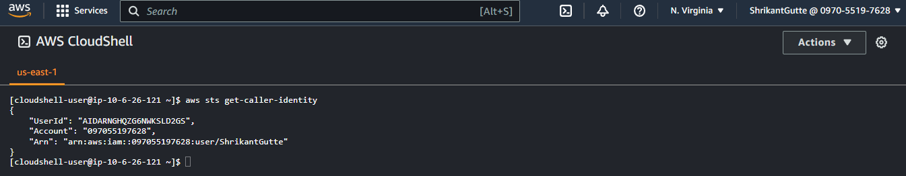
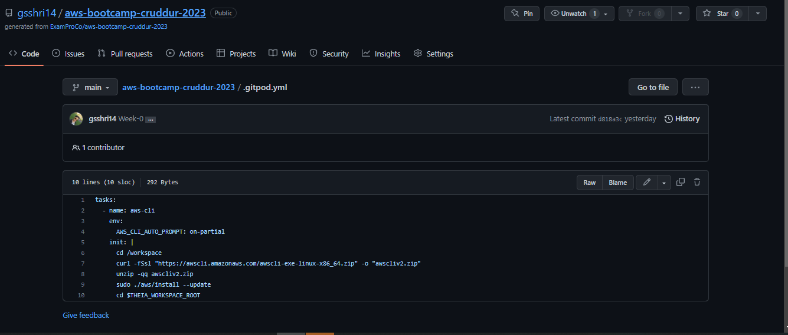
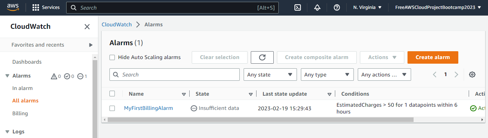
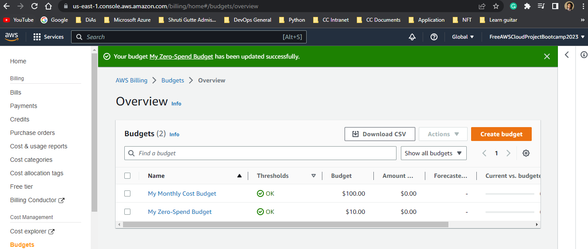

# Week 0 — Billing and Architecture

## Required homework/tasks

### 1. I throughly Watched Week 0 - Live Streamed Video and followed along with the content.
- Link to Live stream: [week 0 - Free AWS Cloud Project Bootcamp](https://www.youtube.com/watch?v=SG8blanhAOg&list=PLBfufR7vyJJ7k25byhRXJldB5AiwgNnWv&index=12)

### 2. I watched Chirag's Week 0 - Spend Considerations Youtube video and followed along with the content.
- 
- Link to Youtube video: [Watched Chirag's Week 0 - Spend Considerations] (https://www.youtube.com/watch?v=OVw3RrlP-sI&list=PLBfufR7vyJJ7k25byhRXJldB5AiwgNnWv&index=13)

### 3. I watched Ashish's Week 0 - Security Considerations Youtube video and followed along with the content.
- 
- Link to Youtube video: [Watched Ashish's Week 0 - Security Considerations] (https://www.youtube.com/watch?v=4EMWBYVggQI&list=PLBfufR7vyJJ7k25byhRXJldB5AiwgNnWv&index=15)

### 4. I recreated conceptual diagram in Lucid Charts.
- 
- Link to the Lucid Charts: [Cruddur conceptual diagramm] (https://lucid.app/lucidchart/273730e5-9ce8-458f-87ff-c3a4bc9df392/edit?viewport_loc=-4964%2C-1323%2C2521%2C1111%2C0_0&invitationId=inv_b34ed1bb-01cc-4f39-a961-689dcae56c24)

### 5. I recreated logical architectual diagramm in Lucid Charts.
- 
- Link to the Lucid Charts: [cruddur architectual diagramm] (https://lucid.app/lucidchart/bbf61757-bfe2-4873-875f-a07b3d86cbad/edit?viewport_loc=-1394%2C-1573%2C5045%2C2223%2C0_0&invitationId=inv_f1937026-6a32-4939-87a0-cab8959d0581)

### 6. I created an admin (IAM) user
- 

### 7. I played around on AWS CloudShell and got to know it.
- 

### 8. I created necessary AWS Credentials for future use.

### 9. I successfully installed AWS CLI on Gitpod.
- During the installation, I had some difficulties. But, later I managed to install AWS CLI using what Andrew Brown showed in this (https://www.youtube.com/watch?v=OdUnNuKylHg) youtube video.
- I used following commands step by step to install AWS CLI on Gitpod and on my local ubuntu machine.
```
1. curl "https://awscli.amazonaws.com/awscli-exe-linux-x86_64.zip" -o "awscliv2.zip"
2. unzip awscliv2.zip
3. sudo ./aws/install --update
```
- 
- I also successfully installed AWS CLI on my local windows machine and played around with it.

### 10. I created a billing alarm successfully.
- 

### 11. I created a budget successfully.
- 
- I created only one budget to be safe not exceeding the limit.
- Going forward, I can create one more.
