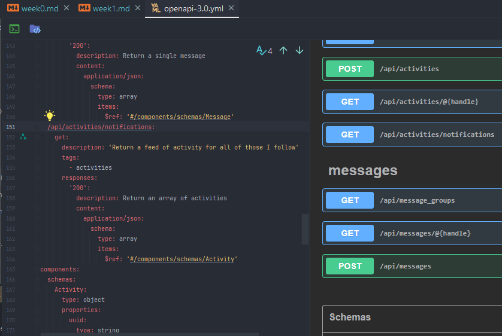
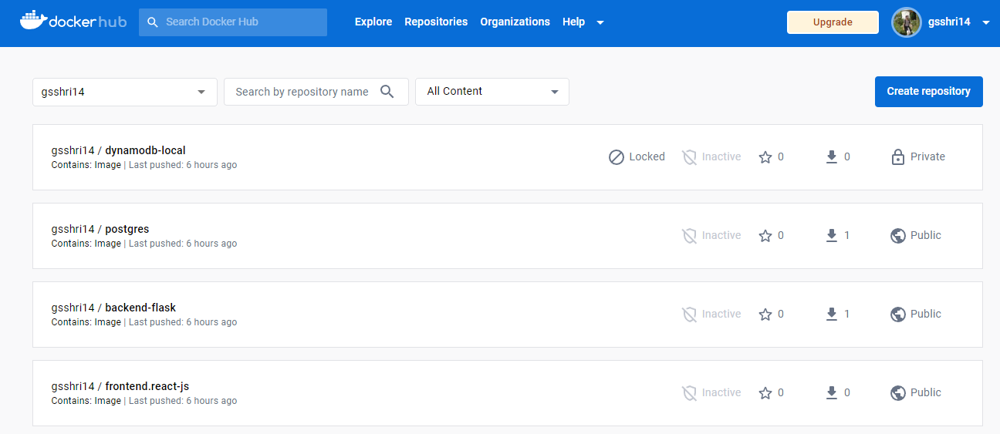
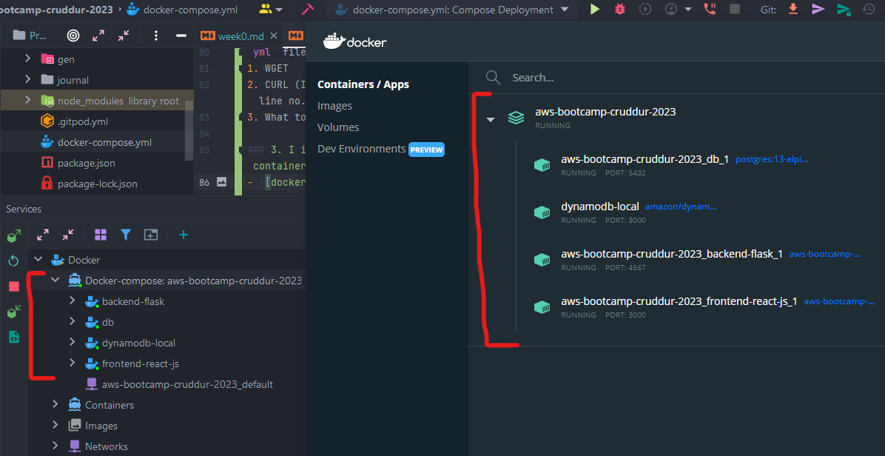

# Week 1 — App Containerization

## Required homework/tasks

### 1. I thoroughly Watched `Watch How to Ask for Technical Help` and understood how to ask for the help in the discord.
- Link to Youtube video: [Watch How to Ask for Technical Help](https://www.youtube.com/watch?v=tDPqmwKMP7Y&list=PLBfufR7vyJJ7k25byhRXJldB5AiwgNnWv&index=29)

### 2. I thoroughly Watched `Watched Grading Homework Summaries` and understood how to improve the structure of the homework summaries before the submission.
- Link to Youtube video: [Watch How to Ask for Technical Help](https://www.youtube.com/watch?v=FKAScachFgk&list=PLBfufR7vyJJ7k25byhRXJldB5AiwgNnWv&index=25)

### 3. I thoroughly Watched `Watched Week 1 - Live Streamed Video` and followed along with the content.
- Link to Live stream: [week 0 - Free AWS Cloud Project Bootcamp](https://www.youtube.com/watch?v=zJnNe5Nv4tE&list=PLBfufR7vyJJ7k25byhRXJldB5AiwgNnWv&index=22)

### 4. I committed and pushed my recent code changes of week-1 on`gsshri14/aws-bootcamp-cruddur-2023` repository.

### 5. I watched Chirag's `Week 1 - Spending Considerations` Youtube video and followed along with the content.
- Link to Youtube video: [Week 1 - Spending Considerations](https://www.youtube.com/watch?v=OAMHu1NiYoI&list=PLBfufR7vyJJ7k25byhRXJldB5AiwgNnWv&index=24)
- I learned 3 different `Cloud Development Environments (CDE)` more, how to configure them, and also how to take care of the billing and costs while using them.
1. `GitPod` (generous free tier and enough for this bootcamp, I use this currently)
2. `GitHub Codespaces` (generous free tier and enough for this bootcamp)
3. `AWS Cloud9` (covered under free tier until the validity of t2.micro instance)
- I also learned that we don't have to configure or set up `AWS CloudTrail` necessarily, because `on default`, it logs all the events.
- Obviously, if we want to track more things like `Data events`, `Insight events` etc.,it gonna be costlier.

### 6. I watched Ashish's `Week 1 - Container Security Considerations` Youtube video and followed along with the content.
- Link to Youtube video: [week 1 - Container Security Considerations](https://www.youtube.com/watch?v=OjZz4D0B-cA&list=PLBfufR7vyJJ7k25byhRXJldB5AiwgNnWv&index=25)
- I learned why container security is essential and how to keep them secure.
- I also learned `container security components` like:
1. `Docker & Host Configuration`
2. `Securing Images`
3. `Secret management`
4. `Application Security`
5. `Data Security`
6. `Monitoring Containers`
7. `Network Security`
8. `Compliance Framework`

- I also learned different security tools for`security`,`image scanning`,`container scanning`,`vulnerabilities`,`secret credentials` etc.
1. `snyk` (Open Source Security tool, I configured it on my `gsshri14/aws-bootcamp-cruddur-2023`, it helped me upgrade some container images by creating an automatic pull request) 
2. `clair`
3. `Amazon Inspector`
4. `AWS Secrets Manager`

### 7. I successfully containerized application (Dockerfiles, Docker Compose).
- Link to Youtube video: [Containerize Application (Dockerfiles, Docker Compose)](https://www.youtube.com/watch?v=zJnNe5Nv4tE&list=PLBfufR7vyJJ7k25byhRXJldB5AiwgNnWv&index=22)
- I successfully created`Dockerfiles` (for frontend and backend) and `docker-compose.yml` file for all 4 components:
1. `backend-flask`
2. `frontend-react-js`
3. `dynamodb-local`
4. `postgres`
- Check out the `docker-compose.yml` file for more information in the project's root folder.

### 8. I successfully documented the `Notification` Endpoint for the OpenAI Document.
- Link to Youtube video: [Document the Notification Endpoint for the OpenAI Document](https://www.youtube.com/watch?v=k-_o0cCpksk&list=PLBfufR7vyJJ7k25byhRXJldB5AiwgNnWv&index=27)
- 

### 9. I successfully wrote a `Flask Backend` Endpoint for Notifications
- Link to Youtube video: [Write a Flask Backend Endpoint for Notifications](https://www.youtube.com/watch?v=k-_o0cCpksk&list=PLBfufR7vyJJ7k25byhRXJldB5AiwgNnWv&index=27)
- Check out these `services/notification_activities.py` and `app.py (from line no. 75 to 78)` for more information.

### 10. I successfully wrote a `React Page` for Notifications.
- Link to Youtube video: [Write a React Page for Notifications](https://www.youtube.com/watch?v=k-_o0cCpksk&list=PLBfufR7vyJJ7k25byhRXJldB5AiwgNnWv&index=27)
- Check out these `frontend-react-js/NotificationsFeedPage.js` for more information.

### 11. I successfully run `DynamoDB Local` Container and ensured it works.
- Link to Youtube video: [Run DynamoDB Local Container and ensure it works](https://www.youtube.com/watch?v=CbQNMaa6zTg&list=PLBfufR7vyJJ7k25byhRXJldB5AiwgNnWv&index=28)
- Check out the `line no. 34 to 51` from `docker-compose.yml` file in the project's root folder for more information.

### 12. I successfully run `Postgres` Container and ensured it works.
- Link to Youtube video: [Run Postgres Container and ensure it works](https://www.youtube.com/watch?v=CbQNMaa6zTg&list=PLBfufR7vyJJ7k25byhRXJldB5AiwgNnWv&index=28)
- Check out the `line no. 53 to 68` from `docker-compose.yml` file in the project's root folder for more information.

## Homework Challenges

### 1. I tagged all 4 local images and pushed them to `Docker Hub` successfully.
- 

### 2. I implemented healthcheck in `docker-compose.yml` successfully.
- I found [Healthcheck In Docker Compose](https://medium.com/geekculture/how-to-successfully-implement-a-healthcheck-in-docker-compose-efced60bc08e) article useful.
- by implementing this, I learned why is it necessary to have a healthcheck for containers and how to implement it in `docker-compose.yml` file by using 3 ways:
1. WGET 
2. CURL (I implemented this in `docker-compose.yml`, for example, check line no. 12 to 17)
3. What to do if CURL/WGET is not available?

### 3. I installed docker on my local machine and successfully created containers for all 4 images.
- 

### 4. I launched an EC2 instance for Ubuntu with docker on AWS and pulled `frontend-react-js` image there to create a container from it.
- 

