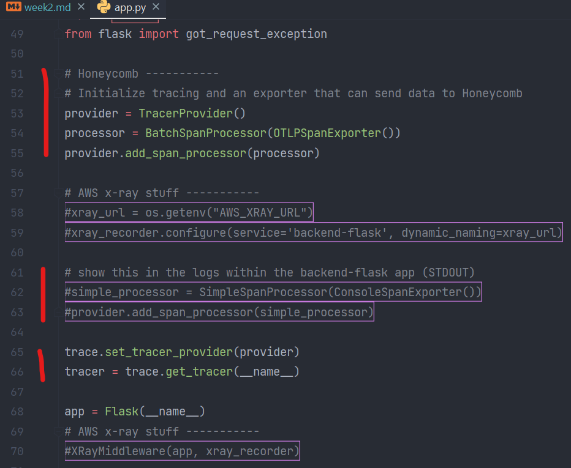
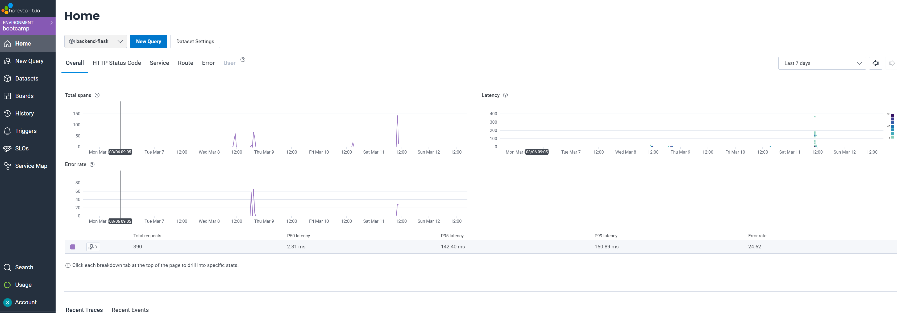
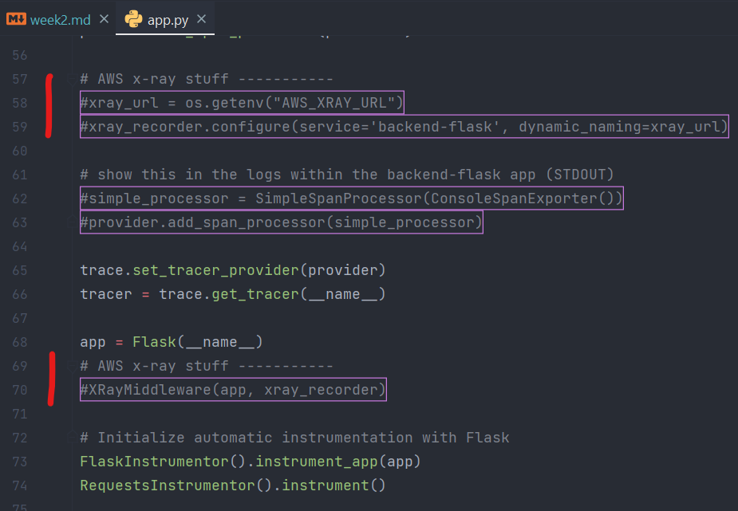
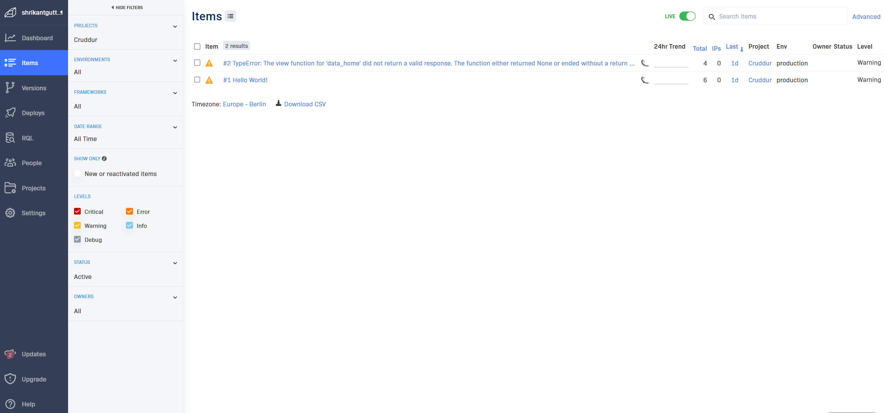
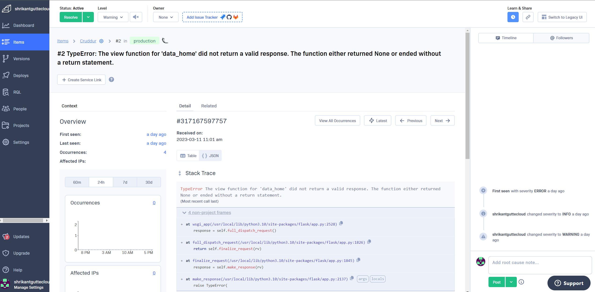

# Week 2 — Distributed Tracing

# Required homework/tasks

### 1. I thoroughly Watched `Watched Week 2 - Live Stream Video` and followed along with the content.
- Link to Live stream: [week 2 - Free AWS Cloud Project Bootcamp](https://www.youtube.com/watch?v=2GD9xCzRId4&list=PLBfufR7vyJJ7k25byhRXJldB5AiwgNnWv&index=30)

### 2. I watched Chirag's `Week 2 - Spending Considerations` Youtube video and followed along with the content.
- Link to YouTube video: [Week 2 - Spending Considerations](https://www.youtube.com/watch?v=2W3KeqCjtDY)
- Through this video, I learned how generous Honeycomb, Rollbar, & AWS X-ray are, to offer a free tier to learn & implement observability and tracing in this project.
- I also successfully completed the `Pricing Quiz` at the end of this video.

### 3. I watched Ashish's `Week 2 - Observability Security Considerations` Youtube video and followed along with the content.
- Link to Youtube video: [week 2 - Observability Security Considerations](https://www.youtube.com/watch?v=bOf4ITxAcXc&list=PLBfufR7vyJJ7k25byhRXJldB5AiwgNnWv&index=31)
- Through this video, I learned why observability of software is essential & also understood AWS CloudWatch way to trace the different metrics and monitor the application.
- I also successfully completed the `Security Quiz` at the end of this video.

### 4. I successfully instrumented Honeycomb with OTEL.
- Link to Youtube video: [week 2 - instrument honeycomb with OTEL](https://www.youtube.com/watch?v=2GD9xCzRId4&list=PLBfufR7vyJJ7k25byhRXJldB5AiwgNnWv&index=30)
- I followed along with the content of the above YouTube video to understand & successfully implement honeycomb with OTEl in project backend.
- 
- 

### 5. I successfully instrumented AWS X-Ray.
- Link to Youtube video: [week 2 - Instrument AWS X-Ray](https://www.youtube.com/watch?v=n2DTsuBrD_A&list=PLBfufR7vyJJ7k25byhRXJldB5AiwgNnWv&index=32)
- I followed along with the content of the above YouTube video to understand & successfully implement AWS X-Ray. 
- 

### 6. I successfully instrumented AWS X-Ray Subsegments.
- Link to Youtube video: [week 2 - Instrument AWS X-Ray subsegments](https://www.youtube.com/watch?v=4SGTW0Db5y0&list=PLBfufR7vyJJ7k25byhRXJldB5AiwgNnWv&index=37)
- I followed along with the content of the above YouTube video to understand & successfully implement AWS X-Ray subsegments.
- 

### 7. I successfully configured custom logger to send to CloudWatch Logs.
- Link to Youtube video: [week 2 - CloudWatch logs](https://www.youtube.com/watch?v=ipdFizZjOF4&list=PLBfufR7vyJJ7k25byhRXJldB5AiwgNnWv&index=33)
- I followed along with the content of the above YouTube video to understand & successfully configure logger to send logs to CloudWatch.
- 
- 

### 8. I successfully integrated Rollbar to capture logs and error.
- Link to Youtube video: [week 2 - Rollbar](https://www.youtube.com/watch?v=xMBDAb5SEU4&list=PLBfufR7vyJJ7k25byhRXJldB5AiwgNnWv&index=35)
- I followed along with the content of the above YouTube video to understand & successfully implemented Rollbar to capture logs and error in the project.
- 
- 
- 

## Homework Challenges

### 1. I ran and playes around with different custom queries, one of them is below for an error.
- 

