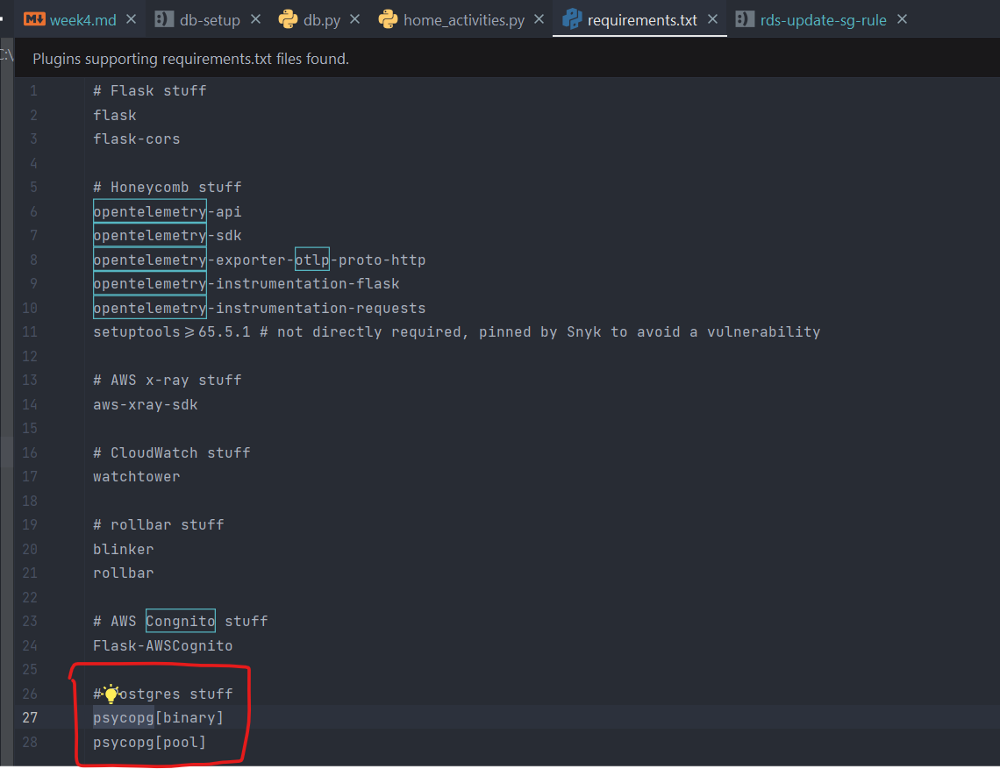
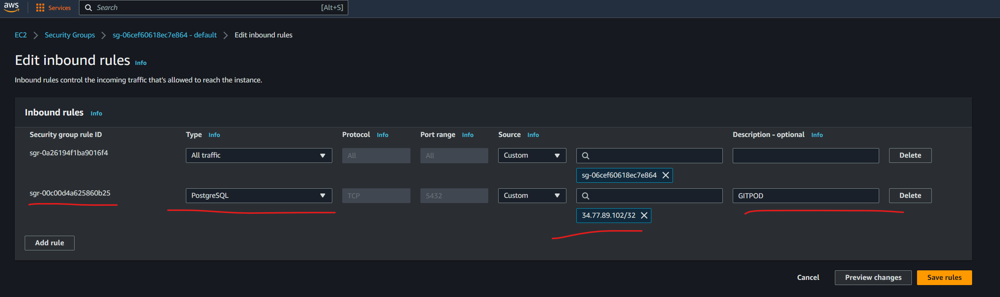
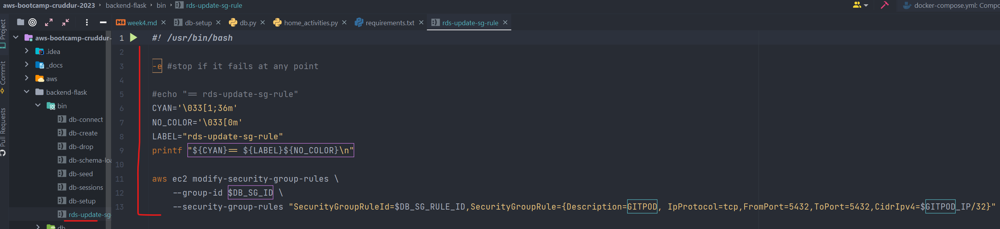
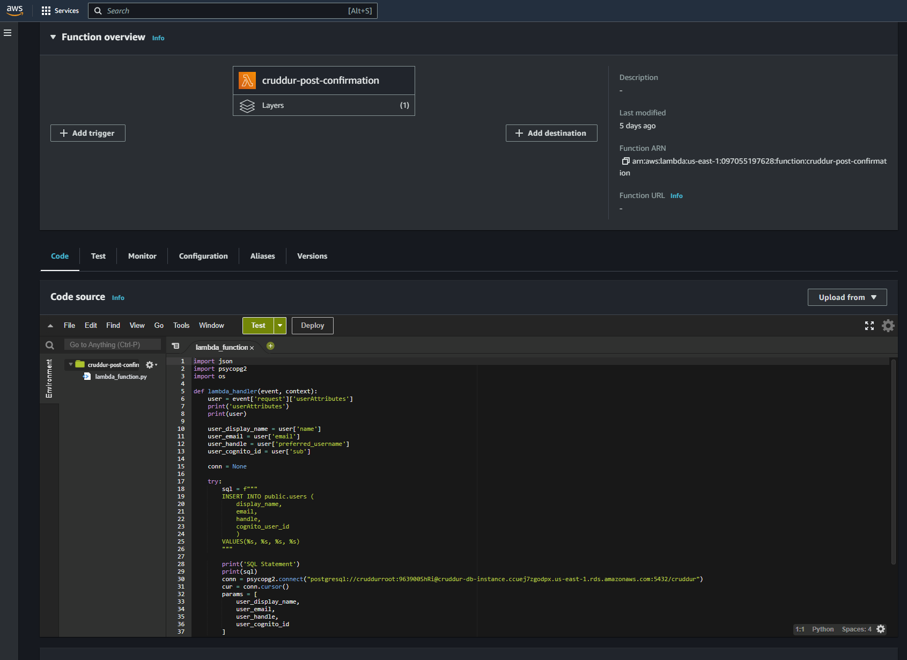
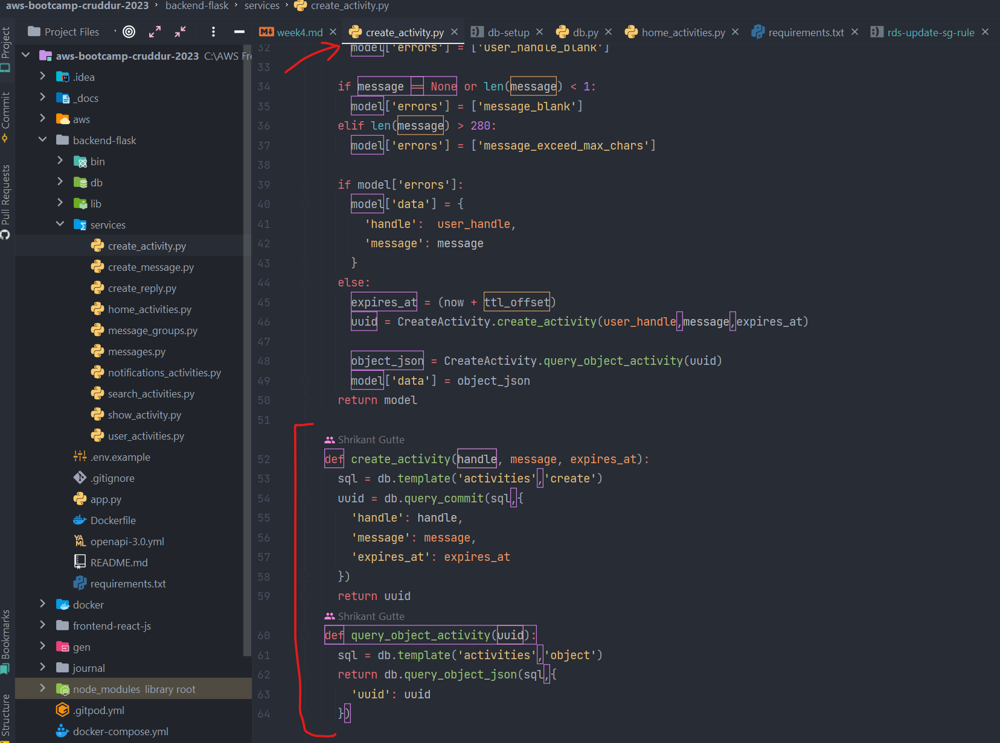
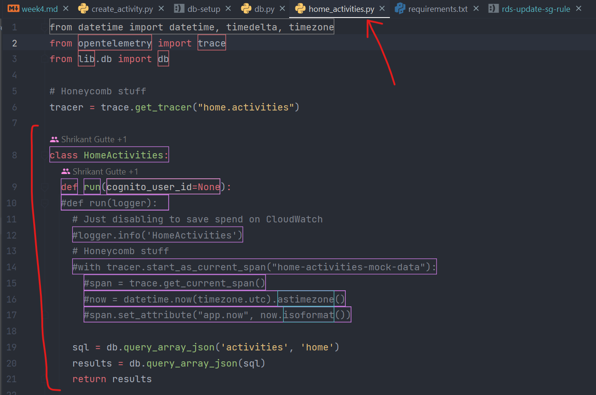

# Week 4 — Postgres and RDS

# Required homework/tasks

### 1. I watched Ashish's `Week 4 - Security Considerations` YouTube video and followed along with the content.
- Link to YouTube video: [week 4 - Security Considerations](https://www.youtube.com/watch?v=UourWxz7iQg&list=PLBfufR7vyJJ7k25byhRXJldB5AiwgNnWv&index=45)
- Through this video, I learned what AWS RDS is & how to secure it wisely.
- I also learned to implement AWS RDS with PostGres. 
- I also successfully completed the `Security Quiz` at the end of this video.

### 2. I thoroughly Watched `Watched Week 4 - Live Stream Video` and followed along with the content to set up the RDS Postgres instance.
- Link to Live stream: [week 4 - Free AWS Cloud Project Bootcamp](https://www.youtube.com/watch?v=EtD7Kv5YCUs&list=PLBfufR7vyJJ7k25byhRXJldB5AiwgNnWv&index=46)
- 
- Through this, I understood how to set up RDS on AWS.

### 3. I thoroughly Watched `Watched Week 4 - Live Stream Video` and followed along with the content to write some bash scripts to execute common database actions.
- Link to Live stream: [week 4 - Free AWS Cloud Project Bootcamp](https://www.youtube.com/watch?v=EtD7Kv5YCUs&list=PLBfufR7vyJJ7k25byhRXJldB5AiwgNnWv&index=46)
- 
- 
- Through this, I understood how to write sql & bash scripts to execute commands on DB.

### 4. I thoroughly Watched `Week 4 SQL RDS` and followed along with the content to install Postgres driver in backend application
- Link to YouTube: [week 4 - SQL RDS driver install](https://www.youtube.com/watch?v=Sa2iB33sKFo&list=PLBfufR7vyJJ7k25byhRXJldB5AiwgNnWv&index=47)
- 
- Through this, I understood how to install RDS driver in backend application.

### 5. I thoroughly Watched `Week 4 SQL RDS` and followed along with the content to connect Gitpod to RDS instance
- Link to YouTube: [week 4 - Connect Gitpod to RDS instance](https://www.youtube.com/watch?v=Sa2iB33sKFo&list=PLBfufR7vyJJ7k25byhRXJldB5AiwgNnWv&index=47)
- 
- 
- Through this, I understood how to update security group rule to connect Gitpod to RDS instance.

### 6. I thoroughly Watched `Week 4 - Cognito Post Confirmation Lambda` and followed along with the content to trigger lambda to insert data into database
- Link to YouTube: [week 4 - Cognito post confirmation lambda](https://www.youtube.com/watch?v=7qP4RcY2MwU&list=PLBfufR7vyJJ7k25byhRXJldB5AiwgNnWv&index=48)
- 
- Through this, I understood how to create lambda, write and execute it to insert data into database.

### 7. I thoroughly Watched `Week 4 - Week 4 - Creating Activities` and followed along with the content to create new activities to insert data into database
- Link to YouTube: [Week 4 - Creating Activities](https://www.youtube.com/watch?v=fTksxEQExL4&list=PLBfufR7vyJJ7k25byhRXJldB5AiwgNnWv&index=49)
- 
- 
- Through this, I understood how to create new activities to insert into the database.

