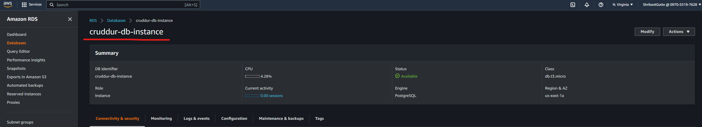
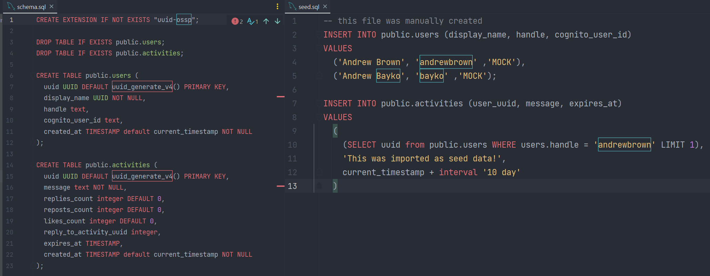
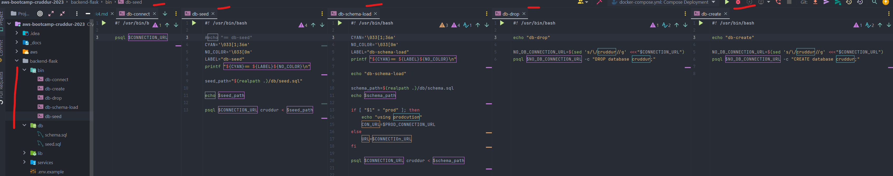

# Week 4 — Postgres and RDS

# Required homework/tasks

### 1. I watched Ashish's `Week 4 - Security Considerations` YouTube video and followed along with the content.
- Link to YouTube video: [week 4 - Security Considerations](https://www.youtube.com/watch?v=UourWxz7iQg&list=PLBfufR7vyJJ7k25byhRXJldB5AiwgNnWv&index=45)
- Through this video, I learned what AWS RDS is & how to secure it wisely.
- I also learned to implement AWS RDS with PostGres. 
- I also successfully completed the `Security Quiz` at the end of this video.

### 2. I thoroughly Watched `Watched Week 4 - Live Stream Video` and followed along with the content to set up the RDS Postgres instance.
- Link to Live stream: [week 4 - Free AWS Cloud Project Bootcamp](https://www.youtube.com/watch?v=EtD7Kv5YCUs&list=PLBfufR7vyJJ7k25byhRXJldB5AiwgNnWv&index=46)
- 
- Through this, I understood how to set up RDS on AWS.

### 3. I thoroughly Watched `Watched Week 4 - Live Stream Video` and followed along with the content to write some bash scripts to execute common database actions.
- Link to Live stream: [week 4 - Free AWS Cloud Project Bootcamp](https://www.youtube.com/watch?v=EtD7Kv5YCUs&list=PLBfufR7vyJJ7k25byhRXJldB5AiwgNnWv&index=46)
- 
- 
- Through this, I understood how to write sql & bash scripts to execute commands on DB.