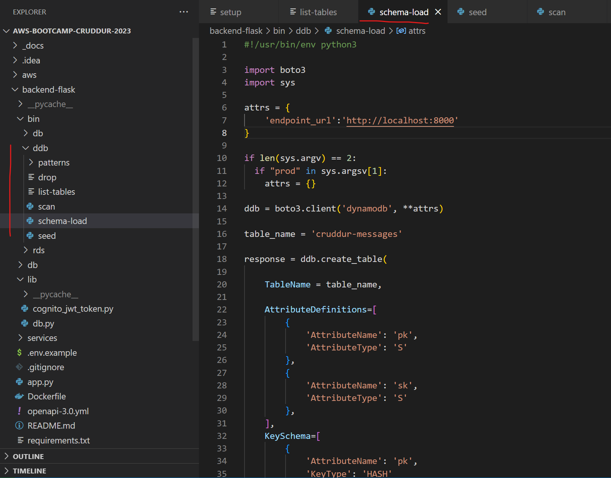
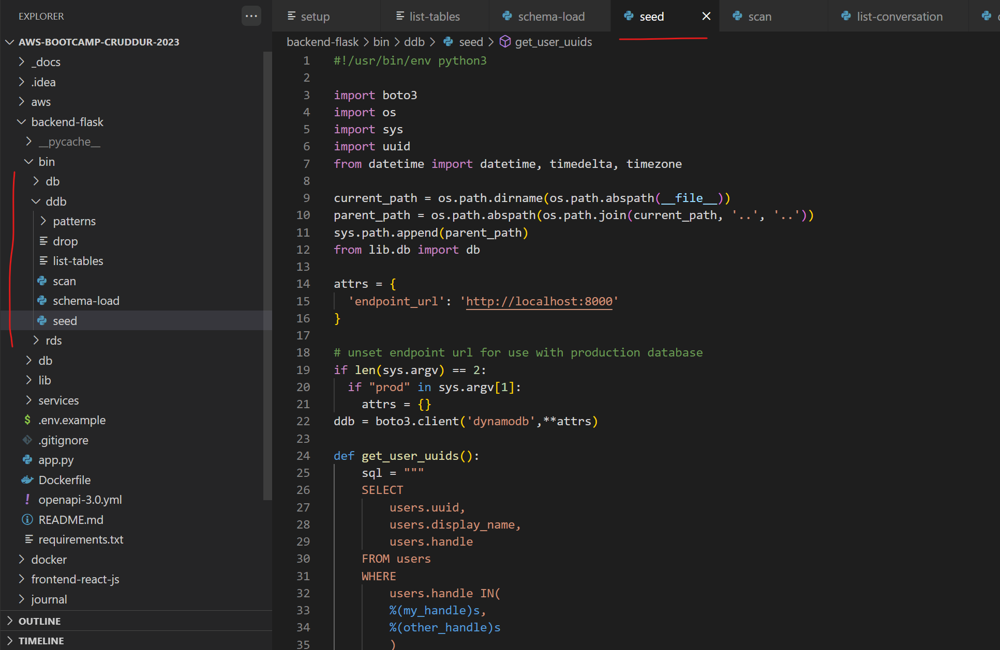

# Week 5 — DynamoDB and Serverless Caching

# Required homework/tasks

### 1. I watched Ashish's `Week 5 - DynamoDB Security Considerations` YouTube video and followed along with the content.
- Link to YouTube video: [week 5 - DynamoDB Security Considerations](https://www.youtube.com/watch?v=gFPljPNnK2Q&list=PLBfufR7vyJJ7k25byhRXJldB5AiwgNnWv&index=52)
- Through this video, I learned what DynamoDB is & how to secure it wisely.
- I also learned to create DynamoDB on AWS with the necessary security considerations.
- I also successfully completed the `Security Quiz` at the end of this video.

### 2. I thoroughly Watched `Week 5 - Live Stream of Data Modelling`
- Link to Live stream: [week 5 - NoSQL and Caching](https://www.youtube.com/watch?v=5oZHNOaL8Og&list=PLBfufR7vyJJ7k25byhRXJldB5AiwgNnWv&index=50)
- Honestly saying: I tried my best to understand what's happening in this live stream, but I failed to do so. LOL:)

### 3. I successfully implemented  `schema load script`
- Link to Live stream: [week 5 - schema load script](https://www.youtube.com/watch?v=pIGi_9E_GwA&list=PLBfufR7vyJJ7k25byhRXJldB5AiwgNnWv&index=52)
- 

### 4. I successfully implemented  `seed script`
- Link to Live stream: [week 5 - seed script](https://www.youtube.com/watch?v=pIGi_9E_GwA&list=PLBfufR7vyJJ7k25byhRXJldB5AiwgNnWv&index=52)
- 

### 5. I successfully implemented  `scan script`
- Link to Live stream: [week 5 - scan script](https://www.youtube.com/watch?v=pIGi_9E_GwA&list=PLBfufR7vyJJ7k25byhRXJldB5AiwgNnWv&index=52)
- 

### 6. I successfully implemented  `Pattern Scripts for Read and List Conversations`
- Link to Live stream: [week 5 - Pattern Scripts for Read and List Conversations](https://www.youtube.com/watch?v=pIGi_9E_GwA&list=PLBfufR7vyJJ7k25byhRXJldB5AiwgNnWv&index=52)
- 

